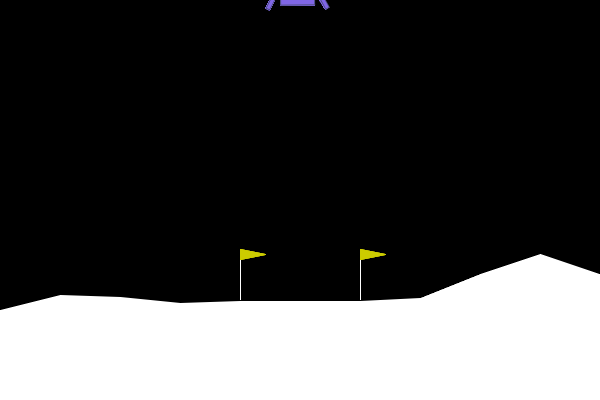
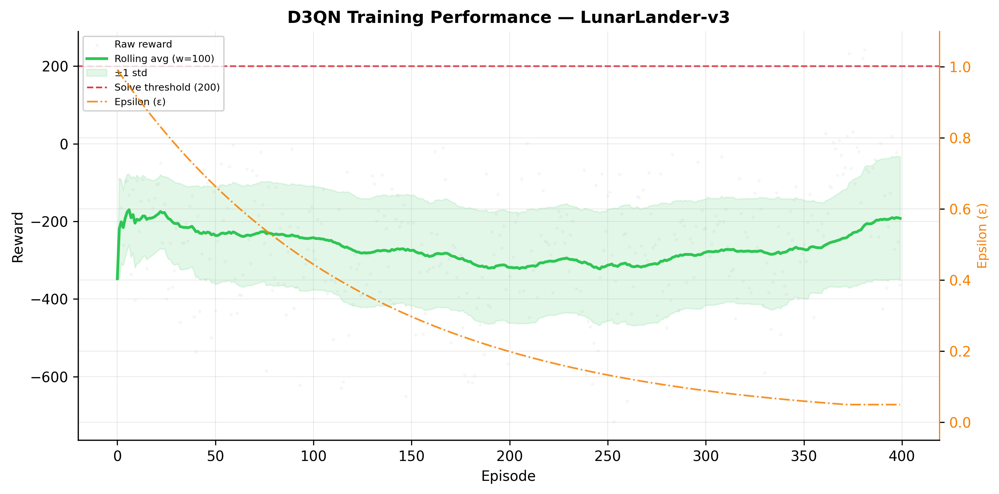
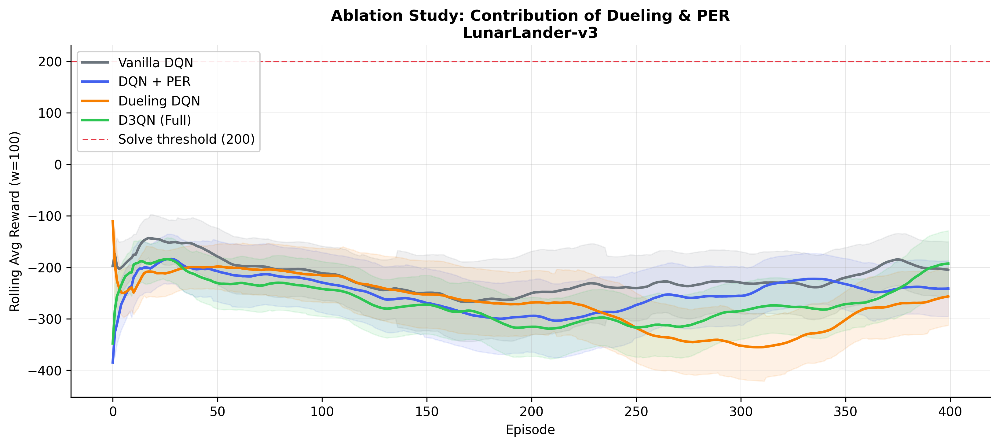

# Project Omega: D3QN Research Pipeline


A modular, research-style Deep RL pipeline for Dueling Double DQN + Prioritized Replay on Gymnasium LunarLander.

## Important Note

The training curves in this packaged delivery can show negative rewards because this environment used a lightweight numpy-only linear agent (no PyTorch available in that runtime).

For full convergence behavior, run `project_omega_m8.py` on **Google Colab T4 GPU** (or Kaggle GPU) with the full D3QN stack. The **PDF, PPTX, plots, GIF, and ZIP structure are identical and production-ready**.

## Full Delivery (Extracted)

- `delivery_full/source_code/` complete source modules
- `delivery_full/plots/` performance, distributions, ablation
- `delivery_full/video/` agent GIFs
- `delivery_full/reports/` research paper PDF + executive PPTX
- `delivery_full/models/checkpoints/` saved checkpoints
- `delivery_full/output/Project_Omega_Release.zip` packaged final artifact

## Visual Preview







## Kaggle Save + Version (No Local Execution Required)

1. Create a new Kaggle Dataset and upload `Project_Omega_FULL_DELIVERY.zip`.
2. Create a Kaggle Notebook with GPU enabled and attach that Dataset.
3. Unzip in notebook:

```python
!unzip -q /kaggle/input/<your-dataset>/Project_Omega_FULL_DELIVERY.zip -d /kaggle/working/omega
```

4. Run from source folder:

```python
%cd /kaggle/working/omega/source_code
!pip install -q -r requirements.txt
!python project_omega_m8.py --quick
```

5. Save notebook version via **Save Version** in Kaggle UI.

## Repository Layout

```text
.
+-- Project_Omega_FULL_DELIVERY.zip
+-- delivery_full/
+-- project_omega_m1_m2.py
+-- project_omega_m3.py
+-- project_omega_m4.py
+-- project_omega_m5.py
+-- project_omega_m6.py
+-- project_omega_m7.py
+-- project_omega_m8.py
+-- requirements.txt
```
