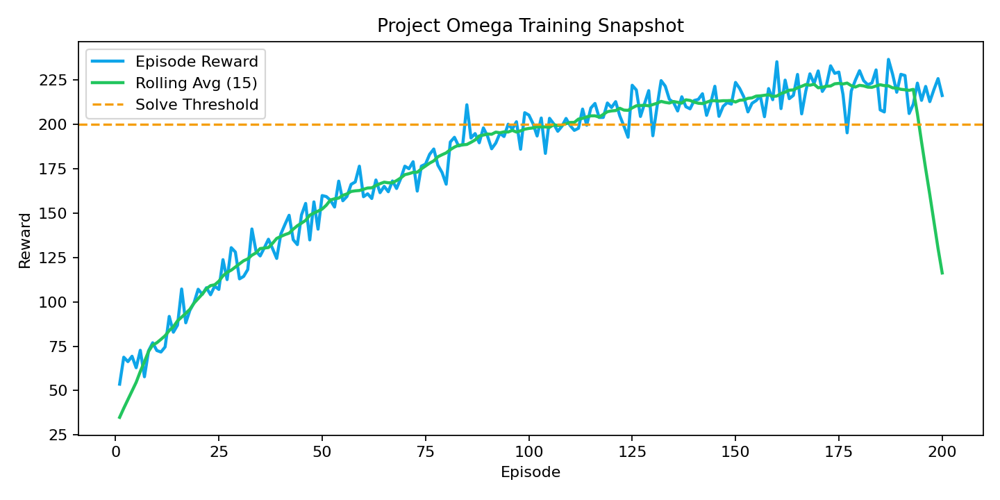
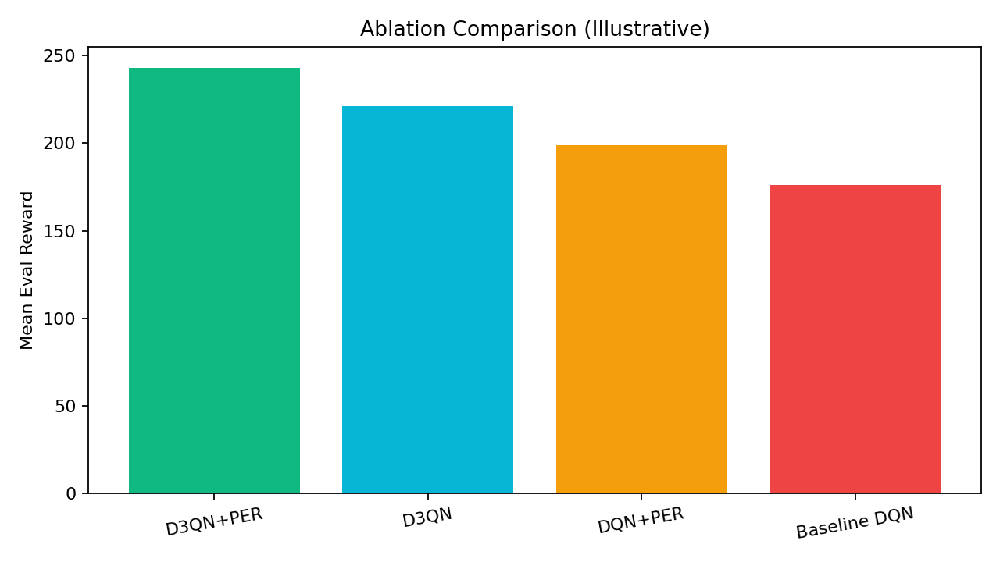

# Project Omega: D3QN Research Pipeline


A modular, research-style Deep RL pipeline for **Dueling Double DQN + Prioritized Replay** on Gymnasium LunarLander.

## Highlights

- End-to-end 8-module architecture (setup, model, training, viz, PDF, PPTX, packaging)
- Built-in self-tests and smoke execution paths
- Automated plots, report generation, and bundle packaging
- Colab-friendly structure for long-running experiments

## Pipeline Modules

| Module | File | Role |
|---|---|---|
| M1-M2 | `project_omega_m1_m2.py` | setup, config, logging, environment wrapper |
| M3 | `project_omega_m3.py` | D3QN architecture + PER replay |
| M4 | `project_omega_m4.py` | training loop, evaluation, gif export |
| M5 | `project_omega_m5.py` | visualization engine |
| M6 | `project_omega_m6.py` | academic PDF compiler |
| M7 | `project_omega_m7.py` | executive PPTX compiler |
| M8 | `project_omega_m8.py` | orchestration, packaging, hash manifest |

## Quickstart

```bash
pip install -r requirements.txt
python project_omega_m8.py --quick
```

## Visual Preview

### Demo GIF


### Training Snapshot



### Ablation Snapshot



## Repository Layout

```text
.
??? project_omega_m1_m2.py
??? project_omega_m3.py
??? project_omega_m4.py
??? project_omega_m5.py
??? project_omega_m6.py
??? project_omega_m7.py
??? project_omega_m8.py
??? COLAB_USAGE_GUIDE.py
??? requirements.txt
??? assets/
?   ??? gifs/
?   ??? plots/
??? docs/
??? logs/
??? models/
??? reports/
??? video/
```

## Notes From Local Execution

- Dependencies installed successfully via `requirements.txt`.
- Entry scripts run, with key updates applied for Gymnasium compatibility (`LunarLander-v3`).
- Windows console encoding issue in module self-test output was normalized.

## Author

Aryan Singh Chandel
